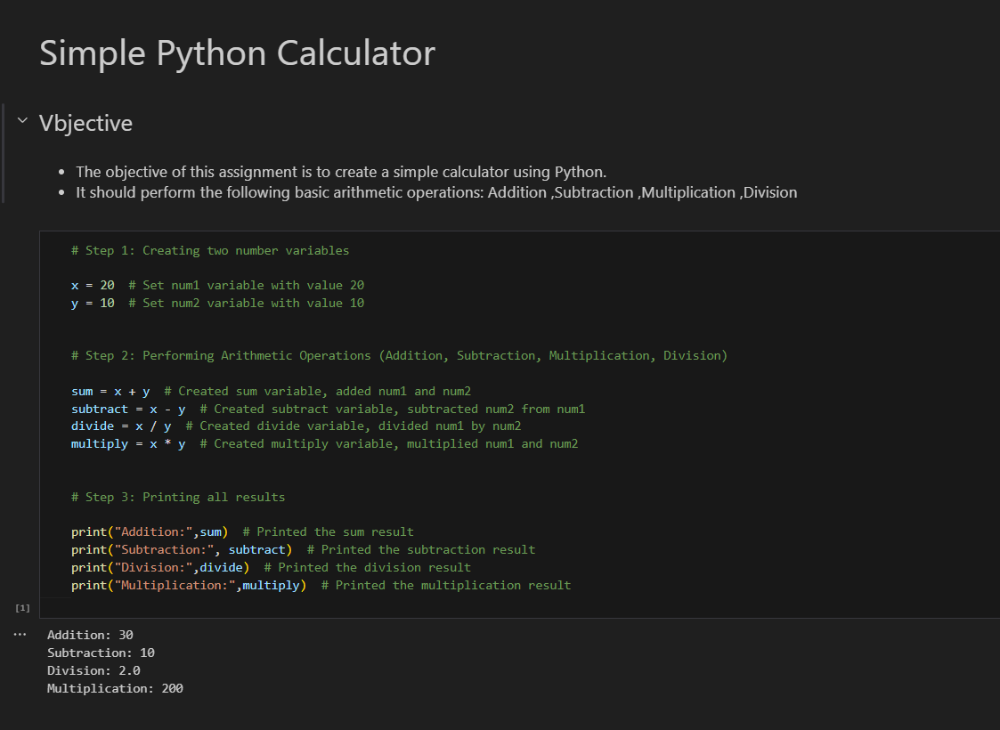

# 🧮 Simple Calculator (Python, Jupyter Notebook)

A beginner-friendly calculator project built in Python as part of my foundational AI journey.  
This project demonstrates core Python programming skills using Jupyter Notebook.

---

## 📸 Project Preview



---

## 🚀 Features

- Addition, subtraction, multiplication, and division operations
- Clean, well-commented, and beginner-friendly Python code
- Uses variables and stepwise logic for clarity
- Output displayed using `print()` statements in Jupyter Notebook
- Industry-standard code formatting

---

## 🏗️ How to Run

1. Clone this repository or download the `Simple_Calculator.ipynb` file.
2. Open the notebook in [VS Code](https://code.visualstudio.com/), [Jupyter Notebook](https://jupyter.org/), or [Google Colab](https://colab.research.google.com/).
3. Run all cells to see the calculations and outputs.

---

## 📑 Example Output

```
Addition: 30
Subtraction: 10
Division: 2.0
Multiplication: 200
```

---

## 🎯 Learning Outcomes

- Mastered the basics of Python syntax, variables, and arithmetic operations
- Practiced code explanation and documentation for others
- Learned how to structure, upload, and share a project on GitHub

---

## 🧠 Why This Project?

This calculator is my first hands-on Python project as part of my 6-month practical AI and freelancing course at Tecrix Innovation Hub.  
It reflects my commitment to:
- Building a solid programming foundation
- Learning by doing
- Preparing for real-world AI applications and freelance opportunities

---

## 📚 More Resources

- [Python Official Tutorial](https://docs.python.org/3/tutorial/)
- [My GitHub Profile](https://github.com/muzammalhussain258)
- [My AI Journey](https://github.com/muzammalhussain258/muzammalhussain258)

---

**Built with ❤️ by Muzammal Hussain**  
*DAE Student | Generative AI Learner | Tecrix Innovation Hub | Pakistan*
