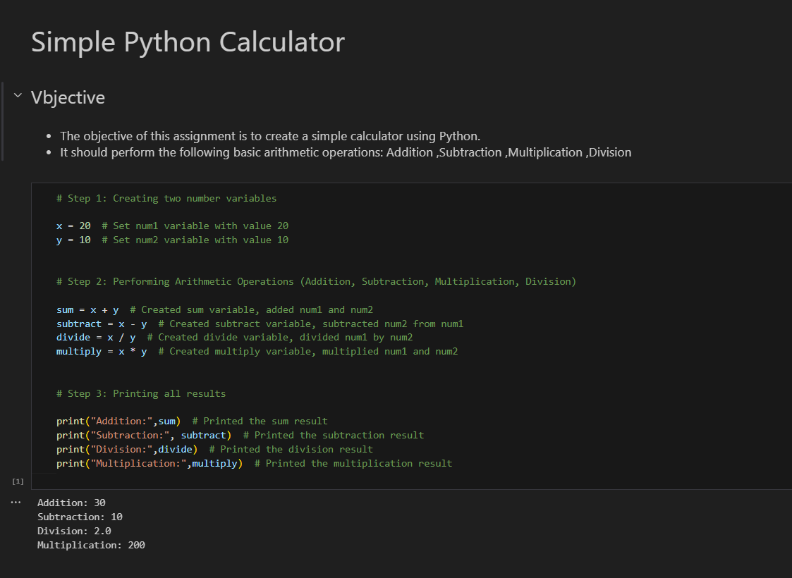

# 🧮 Assignment 1: Simple Calculator

This is my first hands-on Python project!  
A basic calculator that performs addition, subtraction, multiplication, and division on two user-provided numbers.  
Built as part of my “Advanced Generative and Agentic AI” journey at Tecrix Innovation Hub.

---

## ✨ Features

- Accepts two numbers from the user
- Performs addition, subtraction, multiplication, and division
- Handles division by zero with a friendly message
- Clean, beginner-friendly code with helpful comments

---

## 🚦 How to Run

1. Open `simple_calculator.ipynb` in [Jupyter Notebook](https://jupyter.org/) or [Google Colab](https://colab.research.google.com/).
2. Run each cell and follow the prompts to enter numbers and see results.

---

## 🖼️ Screenshot

---

## 📝 What I Learned

- Python input/output basics
- Arithmetic operations and data types
- Writing clear, error-handled code
- Documenting and commenting for clarity

---

**Next up:**  
Try the [Intermediate Calculator →](../assignment2_intermediate_calculator/)

---
