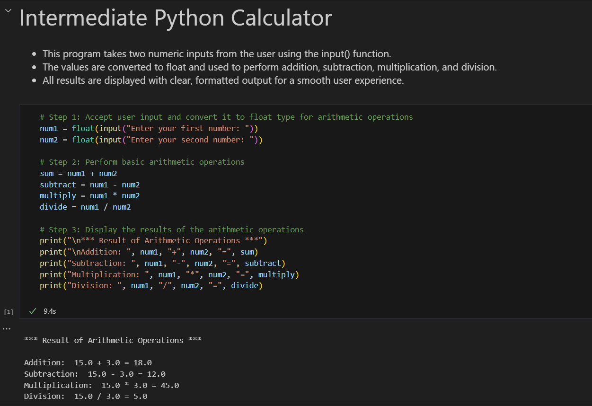

# 🧑‍💻 Assignment 2: Intermediate Calculator

This project extends my basic calculator into a menu-driven tool.  
Users can choose different operations and perform multiple calculations in a row — just like a real calculator!

---

## ✨ Features

- Menu-driven user interface for better interactivity
- Supports addition, subtraction, multiplication, division, and exponentiation
- Can perform multiple calculations in one session
- Robust error handling for invalid choices and division by zero

---

## 🚦 How to Run

1. Open `intermediate_calculator.ipynb` in [Jupyter Notebook](https://jupyter.org/) or [Google Colab](https://colab.research.google.com/).
2. Run the notebook and follow the on-screen menu to perform calculations.

---

## 🖼️ Screenshot

---

## 📝 What I Learned

- Menu-driven program design
- Using loops and conditionals for user interaction
- Improving user experience with clear messages and error handling

---

**Want more features?**  
Explore the [Advanced Calculator →](../assignment3_advanced_calculator/)

---
