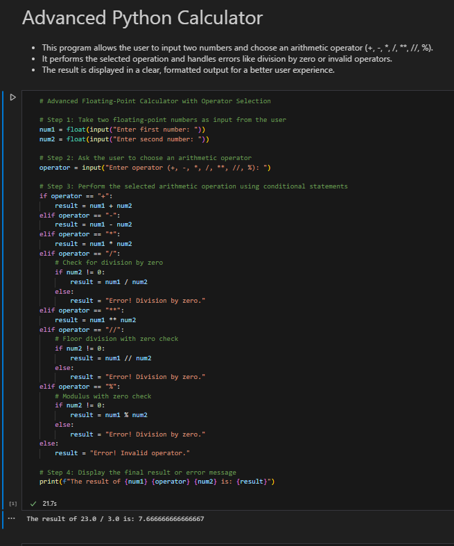

# 🚀 Assignment 3: Advanced Calculator

My most advanced calculator yet!  
This version adds features like calculation history, input validation, and more advanced operations — making it more like a real-world digital calculator.

---

## ✨ Features

- All basic operations, plus square root, power, and modulus
- Maintains a history of past calculations for user reference
- Comprehensive input validation and helpful feedback
- Modular, well-commented code for easy understanding

---

## 🚦 How to Run

1. Open `advanced_calculator.ipynb` in [Jupyter Notebook](https://jupyter.org/) or [Google Colab](https://colab.research.google.com/).
2. Run the notebook, use the menu, and enjoy advanced calculator features!

---

## 🖼️ Screenshot

---

## 📝 What I Learned

- Managing state and program memory (calculation history)
- Writing modular code with functions
- Advanced error handling and input validation
- Designing for real-world usability

---

**Thank you for checking out my calculators!**  
Feedback and suggestions are always welcome.

---
